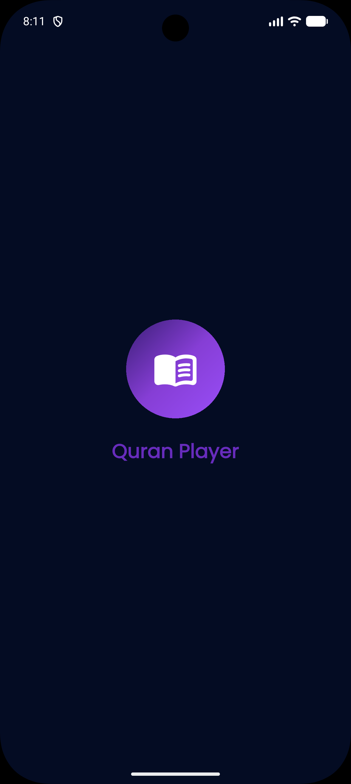
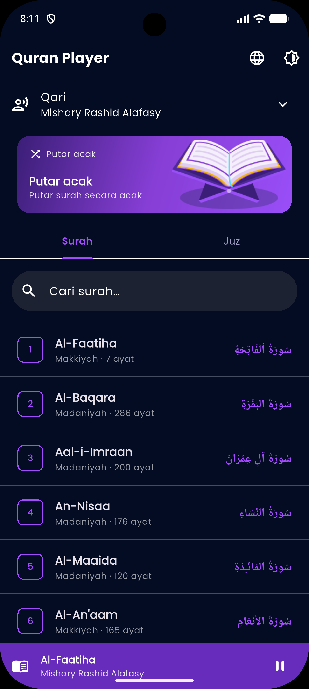
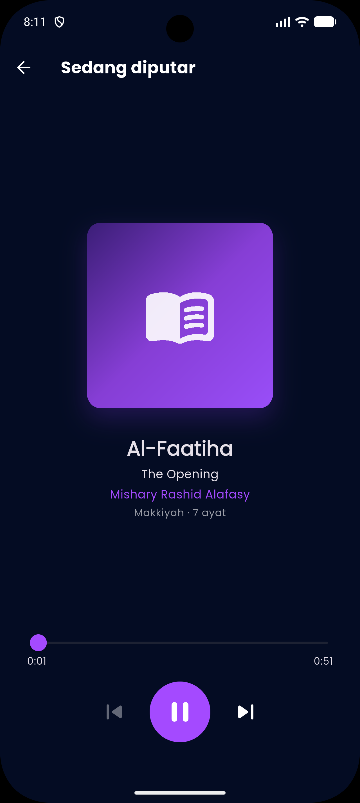
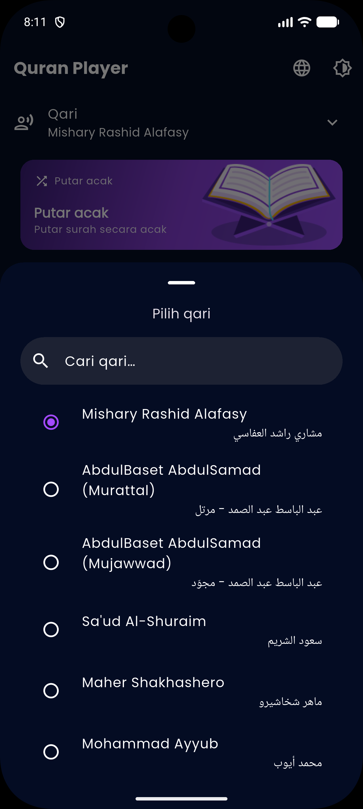
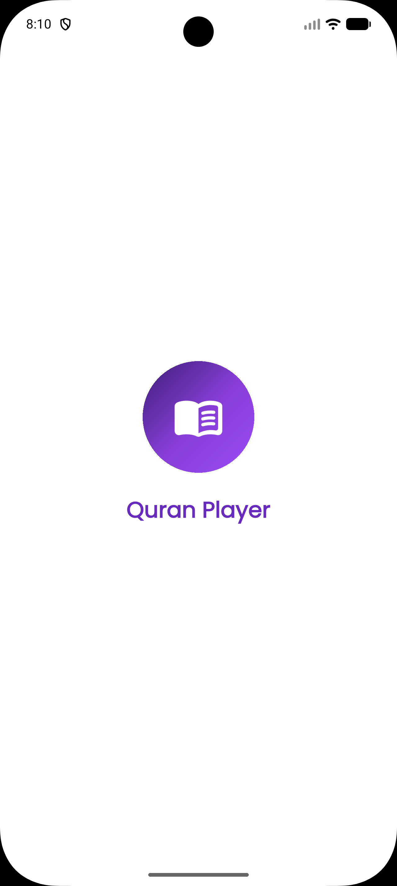
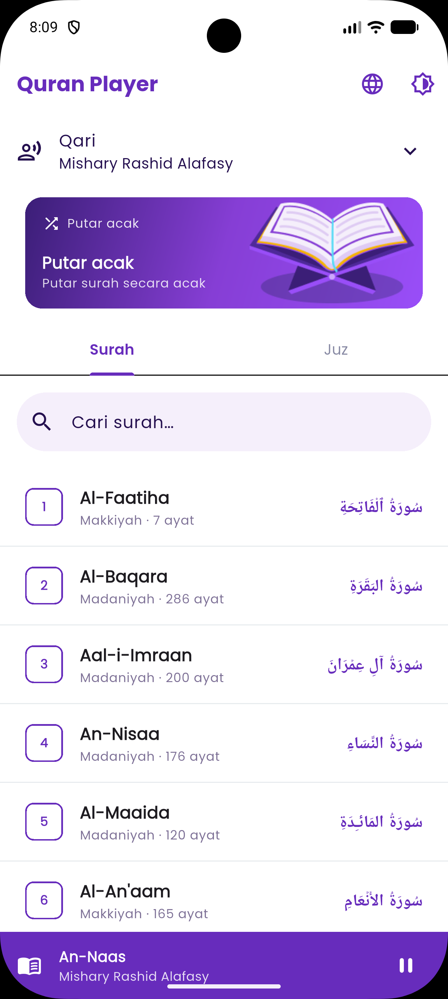
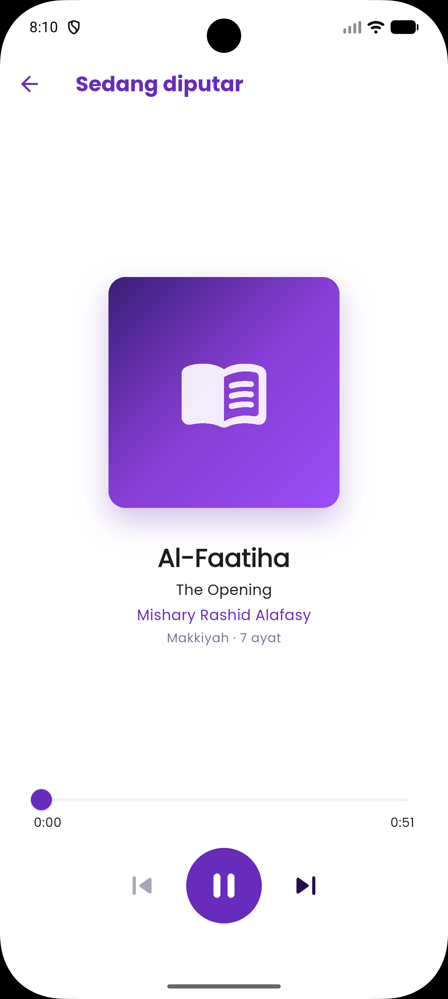
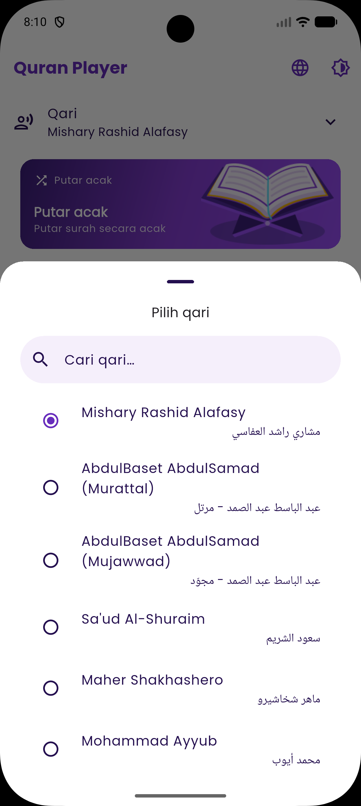

# Quran Player

A mobile **Quran audio player** built with Flutter using the public
[Al-Quran Cloud API](https://alquran.cloud). Browse all 114 surahs or by juz,
pick a reciter (qari), and play with full transport controls, a seekable
progress bar, and resume-where-you-left-off.

---

## Screenshots

### Dark Mode
| Splash                                         | Home                                       | Player                                       | Pilih Qari                               |
| :----------------------------------------------:| :------------------------------------------:| :--------------------------------------------:| :----------------------------------------:|
|  |  |  |  |

### Light Mode
| Splash | Home | Player | Pilih Qari |
|:---:|:---:|:---:|:---:|
|  |  |  |  |

### Demo Video

<p align="center">
  <video src="https://github.com/user-attachments/assets/d5591b01-f06c-4f5f-b471-a3170080fee3" controls width="320"></video>
</p>

> *Note: If the video preview above does not load automatically, you can download or watch the full version directly via this [Simulation Video Link](https://github.com/user-attachments/assets/d5591b01-f06c-4f5f-b471-a3170080fee3).*

> Video recorded on an emulator Android device.

---

## Features

- 🔎 **Search** by surah name or reciter (qari)
- ▶️ **Play / pause / resume** — standard music-player toggle
- ⏱️ **Progress bar** with current position + total duration
- ↔️ **Seek** by dragging the slider
- ⏭️ **Next / previous surah** with auto-advance when a track finishes
- 🎚️ **Mini-player bar** docked on Home while audio is active
- 💾 **Continue listening** — last surah, reciter, and position are persisted
- 📖 **Surah / Juz tabs** — flat list or expandable 30-juz grouping
- 🌗 **Light & dark theme** (follows system or manual override)
- 🌐 **Bilingual UI**: English & Indonesian

---

## Architecture

Clean Architecture with one feature module (`quran_player`) and manual
dependency injection in `main.dart`.

```
lib/
├── l10n/                     # ARB files + generated AppLocalizations (EN/ID)
├── core/
│   ├── audio/                # AudioPlayerService — thin interface over just_audio
│   ├── bloc/                 # Debounce EventTransformer for search
│   ├── constants/            # API/CDN constants, qari list, juz map, asset paths
│   ├── error/                # Failure (typed) + Exception (data layer)
│   ├── network/              # DioClient, logging interceptor, NetworkInfo
│   ├── router/               # go_router config
│   ├── settings/             # SettingsCubit (locale + theme) + persistence
│   ├── theme/                # AppColors, AppDimensions, AppTheme
│   └── utils/                # Result<T> (sealed), formatters
└── features/quran_player/
    ├── data/                 # models (fromJson), datasources, repository impl
    ├── domain/               # entities, repository interface, use cases
    └── presentation/         # blocs, pages, widgets
```

**Dependency flow:**

```
UI → BLoC → UseCase → QuranRepository (interface)
                              ↓
                    QuranRepositoryImpl → DataSource → Dio → API
```

- **Domain** — pure Dart, no Flutter or Dio imports
- **Data** — handles JSON and HTTP, never touches BLoC or UI
- **Presentation** — depends only on use cases and `AudioPlayerService`

### State management

Uses `flutter_bloc` with both Cubit and Bloc:

- **Cubit** (`SettingsCubit`) — simple theme/locale toggles, no event tracing needed
- **Bloc** (`PlayerBloc`, `SurahListBloc`, `EditionBloc`) — search debounce via `EventTransformer`, audio stream bridging, traceable transitions

### Error handling — own `Result<T>`

```dart
sealed class Result<T> {}
final class Ok<T>  extends Result<T> { final T value; }
final class Err<T> extends Result<T> { final Failure failure; }
```

The data layer throws; the repository catches and wraps into `Ok`/`Err`. BLoCs
switch exhaustively and emit typed states — nothing throws into the UI.

---

## Audio approach

The API provides per-ayah audio, but this app uses **full-surah** CDN files
which map better to the music-player model (surah = song):

```
https://cdn.islamic.network/quran/audio-surah/128/{edition}/{surah}.mp3
```

Key findings from manual verification:
- Full-surah audio exists **only at 128 kbps** and for a specific subset of reciters
- API `/edition` identifiers don't match CDN folder names (e.g. `ar.saoodshuraym` → 403; CDN uses `ar.saudalshuraim`)

So the reciter list is a **curated allowlist** in
[`api_constants.dart`](lib/core/constants/api_constants.dart), each entry
verified to return HTTP 206 for surahs 1–114. Display names come from the ID3
tags inside the mp3 files. A failed playback surfaces as `AudioFailure`, never
a crash.

> Long surahs stream progressively (Al-Baqarah ≈ 122 MB). The player shows
> buffering until the duration header arrives.

---

## Tech stack

| Package | Use |
|---|---|
| `flutter_bloc`, `equatable` | State management |
| `dio` + `connectivity_plus` | HTTP client + pre-flight connectivity check |
| `just_audio` | Audio playback |
| `go_router` | Declarative routing |
| `shared_preferences` | Persist settings + last-played |
| `shimmer` | Skeleton loading placeholders |
| `google_fonts` | Poppins |
| `intl` + `flutter_localizations` | EN/ID localisation (`gen-l10n`) |
| `rxdart` | `debounceTime` for search |
| `logger` | Structured logging |
| dev: `bloc_test`, `mocktail`, `flutter_launcher_icons` | Testing + icon |

**Not used:** `dartz` (own `Result<T>`), `get_it` (manual DI), `json_serializable` (3 models → manual `fromJson`), `freezed`.

---

## Getting started

```bash
flutter pub get
flutter gen-l10n            # generates AppLocalizations (also runs on build)
flutter run
```

```bash
flutter analyze
dart format lib/ test/
flutter test
```

**Regenerate app icon** (after changing `assets/icon/app_icon.png`):

```bash
dart run flutter_launcher_icons
```

### Build App

- This app is only available on Android and iOS, not on desktop.

---

## API reference

Base URL: `https://api.alquran.cloud/v1/`

| Endpoint | Use |
|---|---|
| `GET /surah` | All 114 surahs |
| `GET /edition?format=audio` | Audio editions (for display names) |

Audio CDN: see [Audio approach](#audio-approach) above.

---

## Testing

`bloc_test` + `mocktail`, Arrange-Act-Assert pattern. Coverage:

- **Use cases** — surah/artist search, audio URL builder, list fetch via mocked repository
- **Blocs / Cubit** — `SurahListBloc`, `EditionBloc`, `PlayerBloc` (play, seek, next/prev, auto-advance, close), `SettingsCubit`
- **Widgets** — `PlayerControls`, `AudioProgressBar`, `HomePage` (shimmer / list / error)

```bash
flutter test
```

> Windows note: if `flutter_tester.exe` is blocked by App Control policy,
> run with `flutter test --platform chrome`.

---

## Credits

- Data & audio: [Al-Quran Cloud](https://alquran.cloud) / [islamic.network CDN](https://cdn.islamic.network)
- UI design reference: "Quran App Concept" (Figma Community: https://www.figma.com/design/ZPMWOqGTySK5PdCj3ba2Mw/Quran-App-Concept---Free--Community---Copy-?node-id=100-2004). Illustrations adapted; components composed in code.
- Font: Poppins (Google Fonts, OFL).
